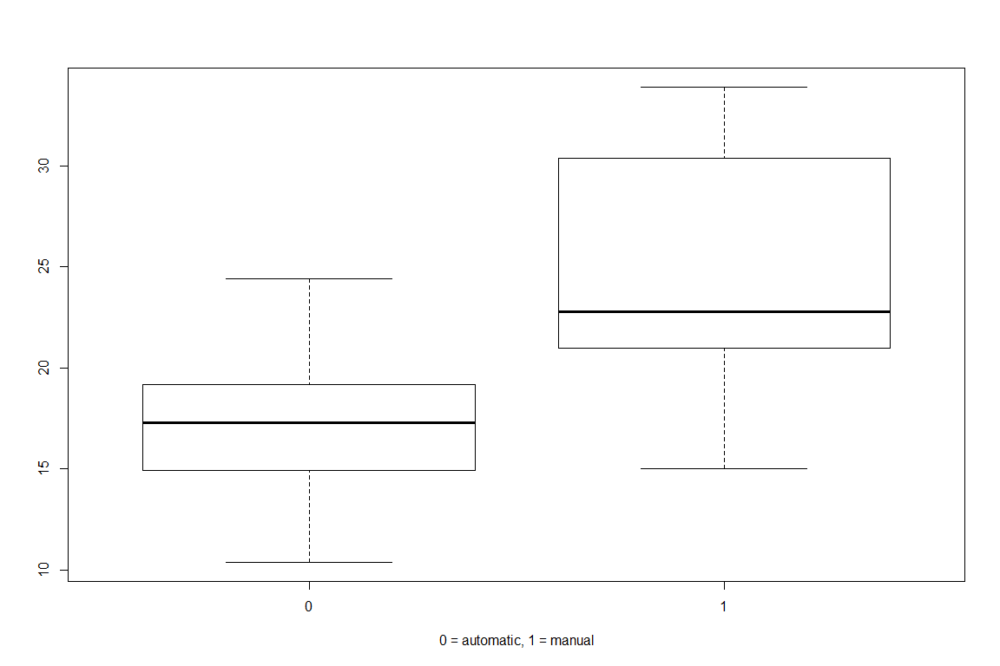
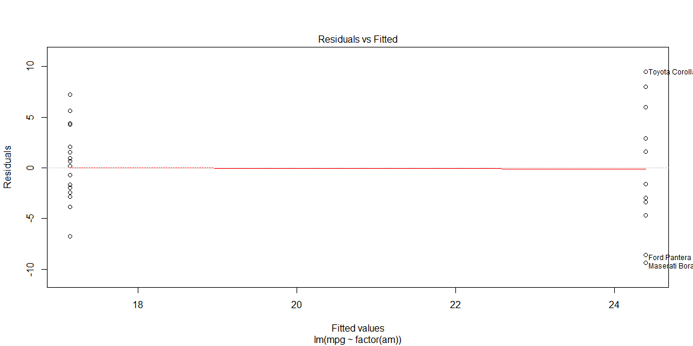
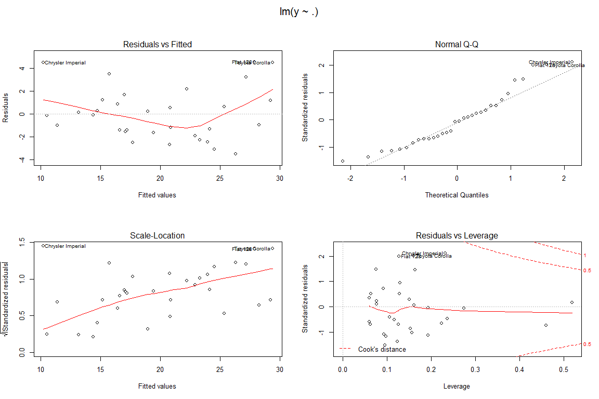
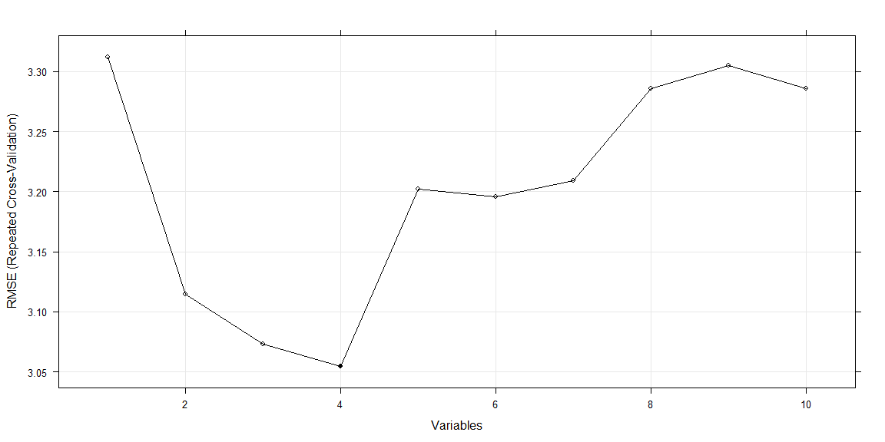

# Regression Models: Peer Assessment
# Automatic or Manual Transmission: Which Has Better MPG?

## Formulating The question
You work for Motor Trend, a magazine about the automobile industry. Looking at a data set of a collection of cars, they are interested in exploring the relationship between a set of variables and miles per gallon (MPG) (outcome). They are particularly interested in the following two questions:

- “Is an automatic or manual transmission better for MPG”
- "Quantify the MPG difference between automatic and manual transmissions"

## Executive Summary

This sheet explores the relationship between miles-per-gallon (MPG) and other variables in the mtcars data set. First, the analysis attempts to determine whether an automatic or manual transmission is better for MPG. At second part of document we find the best fit model for mpg outcome.

Answer for main question - Is an automatic or manual transmission better for MPG? The cars with manual transmission have a better fuel consumption and bigger mileage per gallon. The mean MPG difference between transmissions is equal 7.245 MPG. 

## Quick view on data
Load the data and quick view on it.

```r
data (mtcars)
str (mtcars)
```

```
## 'data.frame':	32 obs. of  11 variables:
##  $ mpg : num  21 21 22.8 21.4 18.7 18.1 14.3 24.4 22.8 19.2 ...
##  $ cyl : num  6 6 4 6 8 6 8 4 4 6 ...
##  $ disp: num  160 160 108 258 360 ...
##  $ hp  : num  110 110 93 110 175 105 245 62 95 123 ...
##  $ drat: num  3.9 3.9 3.85 3.08 3.15 2.76 3.21 3.69 3.92 3.92 ...
##  $ wt  : num  2.62 2.88 2.32 3.21 3.44 ...
##  $ qsec: num  16.5 17 18.6 19.4 17 ...
##  $ vs  : num  0 0 1 1 0 1 0 1 1 1 ...
##  $ am  : num  1 1 1 0 0 0 0 0 0 0 ...
##  $ gear: num  4 4 4 3 3 3 3 4 4 4 ...
##  $ carb: num  4 4 1 1 2 1 4 2 2 4 ...
```

```r
head (mtcars)
```

```
##                    mpg cyl disp  hp drat    wt  qsec vs am gear carb
## Mazda RX4         21.0   6  160 110 3.90 2.620 16.46  0  1    4    4
## Mazda RX4 Wag     21.0   6  160 110 3.90 2.875 17.02  0  1    4    4
## Datsun 710        22.8   4  108  93 3.85 2.320 18.61  1  1    4    1
## Hornet 4 Drive    21.4   6  258 110 3.08 3.215 19.44  1  0    3    1
## Hornet Sportabout 18.7   8  360 175 3.15 3.440 17.02  0  0    3    2
## Valiant           18.1   6  225 105 2.76 3.460 20.22  1  0    3    1
```
The dataset has 32 objects of 11 variables. 

Boxplot show us the strong difference in miles per gallon between automatic and manual transmission.

```r
with (mtcars, boxplot (mpg ~ am, xlab = "0 = automatic, 1 = manual"))
```

 

## Linear model based on transmisison


```r
fit <- lm (mpg ~ factor (am), mtcars)
summary (fit)
```

```
## 
## Call:
## lm(formula = mpg ~ factor(am), data = mtcars)
## 
## Residuals:
##     Min      1Q  Median      3Q     Max 
## -9.3923 -3.0923 -0.2974  3.2439  9.5077 
## 
## Coefficients:
##             Estimate Std. Error t value Pr(>|t|)    
## (Intercept)   17.147      1.125  15.247 1.13e-15 ***
## factor(am)1    7.245      1.764   4.106 0.000285 ***
## ---
## Signif. codes:  0 '***' 0.001 '**' 0.01 '*' 0.05 '.' 0.1 ' ' 1
## 
## Residual standard error: 4.902 on 30 degrees of freedom
## Multiple R-squared:  0.3598,	Adjusted R-squared:  0.3385 
## F-statistic: 16.86 on 1 and 30 DF,  p-value: 0.000285
```
The beta0 coefficient (Intercept) is equal 17.147 and beta1 coefficient is equal 7.245. It means that the average MPG for cars with automatic transmission is 17.147 MPG, and the average MPG for cars with manual transmissions is beta0 plus beta1 = 24.392 MPG.
The mean MPG difference between transmissions equal beta1, 7.245 MPG - the cars with manual transmission have a better fuel consumption and bigger mileage per gallon.

Please, go to Appendix to see a residual plot for this model.


```r
plot (fit, which = 1)
```

 

The 95% confidence intervals for beta0 and beta1:

```r
sumCoef <- summary (fit)$coefficients
sumCoef [1,1] + c(-1, 1) * qt(.975, df = fit$df) * sumCoef [1, 2] # beta0
```

```
## [1] 14.85062 19.44411
```

```r
sumCoef [2,1] + c(-1, 1) * qt(.975, df = fit$df) * sumCoef [2, 2] # beta1
```

```
## [1]  3.64151 10.84837
```

The p-values are small for all coefficents and all predictors are significant. 

## Multivariable linear model

Ok, let's try to find the best fit linear model using one of my favorite packages - caret (http://topepo.github.io/caret/index.html).
Caret packages suggests a different feature selection methods, such as recursive feature selection, Genetic Algorithms, Simulated Annealing. Apply the simplest, RFE method.

First, create an rfeControl object, that  specifies the details of the feature selection. Argument 'function' is set to 'lmFuncs', method to repeated cross validation and repeats is equal five. Don't forget to set seed for reproducible research.


```r
library ('caret')
```

```
## Warning: package 'caret' was built under R version 3.2.3
```

```
## Loading required package: lattice
## Loading required package: ggplot2
```

```r
set.seed (1)
ctrl <- rfeControl (functions = lmFuncs,
                    method = "repeatedcv",
                    repeats = 5,
                    verbose = FALSE)
```

Second, call the rfe function, that fits the model. X is predictors (first column of data frame is MPG) and Y is an outcome. The 'sizes' arguments corresponds to the number of features that should be retained.

```r
lmProfile <- rfe (x = mtcars [-1], mtcars [ , 1],
                  sizes = 1:10,
                  rfeControl = ctrl)

predictors (lmProfile)
```

```
## [1] "wt"   "am"   "qsec" "hp"
```

The last command tell us that the best model is with predictors weigth, A/M tansmission, 1/4 mile time and horsepower.
Look at summary model.

```r
lmfit <- lmProfile$fit
summary (lmfit)
```

```
## 
## Call:
## lm(formula = y ~ ., data = tmp)
## 
## Residuals:
##     Min      1Q  Median      3Q     Max 
## -3.4975 -1.5902 -0.1122  1.1795  4.5404 
## 
## Coefficients:
##             Estimate Std. Error t value Pr(>|t|)   
## (Intercept) 17.44019    9.31887   1.871  0.07215 . 
## wt          -3.23810    0.88990  -3.639  0.00114 **
## am           2.92550    1.39715   2.094  0.04579 * 
## qsec         0.81060    0.43887   1.847  0.07573 . 
## hp          -0.01765    0.01415  -1.247  0.22309   
## ---
## Signif. codes:  0 '***' 0.001 '**' 0.01 '*' 0.05 '.' 0.1 ' ' 1
## 
## Residual standard error: 2.435 on 27 degrees of freedom
## Multiple R-squared:  0.8579,	Adjusted R-squared:  0.8368 
## F-statistic: 40.74 on 4 and 27 DF,  p-value: 4.589e-11
```

Diagnostic plots for fitting model. Residuals vs Fitted looks good without any pattern. Normal QQ plot is on the line.

```r
par (mfrow = c (2, 2), oma = c (0, 0, 2, 0))
plot (lmfit)
```

 

##Appendix
1. Best fit model feauture selection. Root Mean Squared Error (RMSE).

```r
trellis.par.set(caretTheme())
plot(lmProfile, type = c("g", "o"))
```

 
